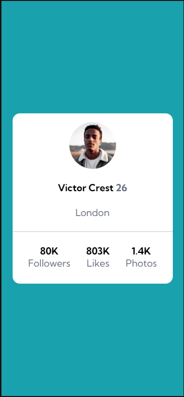

# Projeto Profile card component

## Sobre
 - Projeto personalizado proposto pelo curso DevQuest do devmemdobro.
- Link do projeto original: https://www.frontendmentor.io/challenges/profile-card-component-cfArpWshJ
 
## Tecnologias utilizadas

- HTML
- CSS

## Aprendizado
 - Neste projeto, aprendi a posicionar os elementos com o flexbox. Admito que inicialmente estava com dificuldades para entender a dinâmica do flexbox. 
 - Aprendi que o CSS só enxerga a hierarquia pai-filho;
 - Para que as propriedades funcionem nos elementos-filhos, as pais devem ter propriedade display: flex.

### O que é a tag hr?
    
    

    
- O elemento é exibido mais frequentemente como uma regra horizontal que é usada para separar conteúdo. Mais informações: [HTML hr tag (w3schools.com)](https://www.w3schools.com/tags/tag_hr.asp)
    
### Por que não há um arquivo responsivo.css?
    
- Justamente por conta do cartão ser totalmente flexível. Mas pode ser adaptado conforme necessidade. Testado com responsive viewer.

## Resultado do projeto

- Desktop design

- Mobile design

